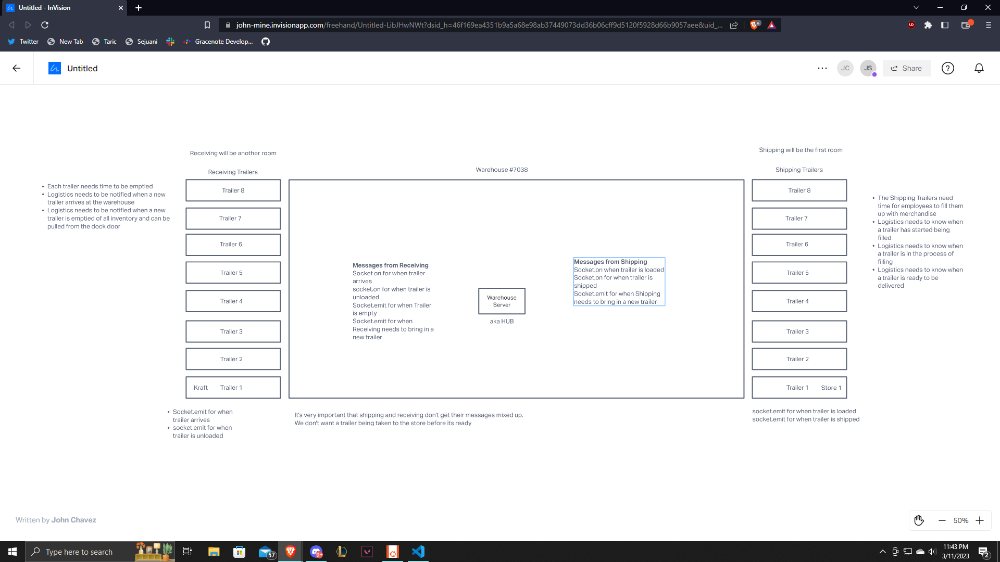

# LAB - Class 14

## Project: Warehouse Events

### Author: Jonathan Staib

### Problem Domain

Build a socket server of our own with the knowledge that we have learned so far.

### Links and Resources

- Ryan Gallaway

### Setup

#### `.env` requirements (where applicable)

PORT

#### How to initialize/run your application (where applicable)

`node server/hub.js`

#### How to use your library (where applicable)

#### Features / Routes

running node shipping/index.js, node server/hub.js and receiving/index.js will make events where the servers talk to eachother.

#### UML

